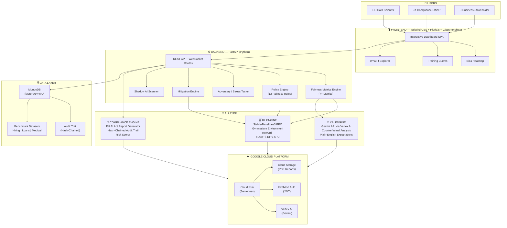

<div align="center">


<br/>

[](https://developers.google.com/community/gdsc-solution-challenge)
[](https://fastapi.tiangolo.com/)
[](https://cloud.google.com/)
[](https://deepmind.google/technologies/gemini/)
[](https://pytorch.org/)
[]()
[](https://mongodb.com/)
[](https://docker.com/)

<br/>

<table>
<tr>
<td align="center"><b>🏅 Team</b></td>
<td align="center"><b>🎯 Focus</b></td>
<td align="center"><b>🛤️ Track</b></td>
<td align="center"><b>🌍 Impact</b></td>
</tr>
<tr>
<td align="center">MASSIVE-X</td>
<td align="center">AI Fairness & Responsible AI</td>
<td align="center">Unbiased AI Decision-Making</td>
<td align="center">SDG 10 & SDG 16</td>
</tr>
</table>

<br/>

> **FairForge Arena** is an **enterprise-grade AI Fairness Training Gym** — a complete platform to **detect**, **measure**, **explain**, and **automatically eliminate** hidden algorithmic bias before it impacts real people's lives.

<br/>

> [!NOTE]
> **☁️ Deployment Notice** — Due to a temporary Google Cloud billing issue, FairForge Arena is deployed on **Vercel** for fast and reliable access. It is built with a cloud-native architecture and is **fully ready for scalable deployment on Google Cloud (Cloud Run + Vertex AI)**.

<br/>

[](#-the-fairforge-workflow)
[](#-the-fairforge-workflow)
[](#-the-fairforge-workflow)
[](#-the-fairforge-workflow)
[](#-the-fairforge-workflow)

</div>

---

## 📋 Table of Contents

- [🌍 UN SDG Alignment](#-un-sdg-alignment)
- [✨ Key Features](#-key-features)
- [🚀 The FairForge Workflow](#-the-fairforge-workflow)
- [🏗️ System Architecture](#️-system-architecture)
- [💻 Technology Stack](#-technology-stack)
- [📂 Project Structure](#-project-structure)
- [⚙️ Quick Start](#️-quick-start)
- [📊 Results & Impact](#-results--impact)
- [🔮 Future Roadmap](#-future-roadmap)
- [📜 License](#-license)

---

## 🌍 UN SDG Alignment

<div align="center">

| &nbsp;&nbsp;&nbsp;&nbsp;&nbsp;&nbsp;SDG&nbsp;&nbsp;&nbsp;&nbsp;&nbsp;&nbsp; | Goal | How FairForge Helps |
|:---:|:---|:---|
| 🟠 **SDG 10** | Reduced Inequalities | Prevents algorithmic discrimination against marginalized groups in high-stakes automated decisions — hiring, lending, healthcare diagnosis — ensuring equal treatment regardless of race, gender, or age. |
| 🔵 **SDG 16** | Peace, Justice & Strong Institutions | Delivers transparent, auditable, and explainable AI governance through automated compliance reporting, cryptographic audit trails, and EU AI Act-aligned documentation. |

</div>

---

## ✨ Key Features

<div align="center">

```
╔══════════════════════════════════════════════════════════════════════════════╗
║                        FAIRFORGE ARENA  —  CAPABILITIES                      ║
╠══════════════════╦═══════════════════════════════════════════════════════════╣
║  🔍  DETECT      ║  Intersectional Bias Heatmap (gender × race × age)        ║
║  📊  MEASURE     ║  7+ Fairness Metrics  |  Auto-detect protected attributes ║
║  🚩  FLAG        ║  Real-Time Drift Monitoring  |  Automated Alerts          ║
║  🏋️  TRAIN       ║  PPO RL Agent  |  Live Training Curves                    ║
║  ⚡  FIX         ║  One-Click Mitigation Controls  |  Instant Impact View    ║
║  🤖  EXPLAIN     ║  Gemini Counterfactual XAI  |  Plain-English Decisions    ║
║  🕵️  SCAN        ║  Shadow AI Scanner  |  LLM Usage Detection in Text        ║
║  📄  COMPLY      ║  EU AI Act PDF Reports  |  EEOC Four-Fifths Rule          ║
║  🔗  SECURE      ║  Hash-Chained Integrity Trail  |  Tamper-Proof Logs       ║
║  📈  BENCHMARK   ║  GPT-4o | Claude 3.5 | Gemini 1.5 | Llama 3.1 | Mistral   ║
╚══════════════════╩═══════════════════════════════════════════════════════=════╝
```

</div>

### Feature Deep-Dive

<details>
<summary><b>🔍 Intersectional Bias Heatmap</b></summary>

Visualize bias across intersecting demographic dimensions — gender × race × age — in a single color-coded heatmap. Instantly spot which specific subgroup combinations are most impacted by discriminatory model behavior.

</details>

<details>
<summary><b>🏋️ PPO Reinforcement Learning Arena</b></summary>

An active training gym powered by **Stable-Baselines3 PPO** that trains biased models against adversarial fairness constraints. The RL reward function mathematically optimizes the trade-off:

```
Reward = α·Accuracy − β·|Disparate Impact − 1| − γ·Statistical Parity Diff
```

Watch the agent improve fairness in real-time through live training curves.

</details>

<details>
<summary><b>🤖 Gemini Counterfactual Explainer</b></summary>

Powered by **Google Gemini API via Vertex AI**, this engine ingests fairness metrics and model decisions to generate plain-English "What-If" scenarios:

> *"If the applicant's age was 5 years older, their loan approval probability increases by 12%."*

Makes complex algorithmic decisions understandable for compliance officers and business stakeholders.

</details>

<details>
<summary><b>🕵️ Shadow AI Scanner</b></summary>

Detect undisclosed LLM usage in any text by analyzing structural patterns, sentence rhythms, and LLM-specific phraseology. Crucial for organizations managing AI governance and disclosure requirements.

</details>

<details>
<summary><b>🔗 Integrity Trail</b></summary>

Every audit action is stored in a **cryptographically hash-chained log** (each event contains the hash of the previous), making tampering mathematically detectable. Your audit trail is as secure as a blockchain.

</details>

---

## 🚀 The FairForge Workflow

```
                        ┌─────────────────────────────────────────────────┐
                        │           FAIRFORGE ARENA WORKFLOW              │
                        └─────────────────────────────────────────────────┘

   ┌──────────┐      ┌──────────┐      ┌──────────┐      ┌──────────┐      ┌──────────┐
   │  UPLOAD  │ ───▶│  AUDIT   │ ───▶ │ MITIGATE │ ───▶│ EXPLAIN  │ ───▶ │  EXPORT  │
   │          │      │          │      │          │      │          │      │          │
   │ Dataset  │      │Fairness  │      │Fix Bias  │      │ Gemini   │      │EU AI Act │
   │  Model   │      │  Check   │      │(RL+Fixes)│      │  XAI     │      │   PDF    │
   └────┬─────┘      └────┬─────┘      └────┬─────┘      └────┬─────┘      └────┬─────┘
        │                 │                  │                  │                  │
        ▼                 ▼                  ▼                  ▼                  ▼
   • Auto-detect     • 7 Metrics       • Reweight         • Counterfactual   • EU AI Act
     schema          • Heatmap         • Drop Proxy         What-If          • Audit Logs
   • Protected       • Violations      • Threshold        • Plain-English    • Risk Docs
     attributes        Panel           • PPO Training       Answers          • Compliance
```

### Step-by-Step

| # | Phase | Action | Outcome |
|---|-------|--------|---------|
| **1** | 🔍 **MEASURE** | Upload dataset/model → auto-compute Disparate Impact, Demographic Parity, Equal Opportunity, Intersectional Bias | Know *exactly* where bias exists and how severe it is |
| **2** | 🚩 **FLAG** | Real-time drift monitoring, adversarial stress-testing, edge-case probing | Catch bias before it reaches production |
| **3** | ⚡ **FIX** | One-click mitigation (reweighting, proxy removal, threshold tuning) + PPO RL training | Mathematically reduce bias with minimal accuracy cost |
| **4** | 🤖 **EXPLAIN** | Gemini counterfactuals, What-If explorer, natural language decision explanations | Make fairness legible for every stakeholder |
| **5** | 📄 **COMPLY** | Generate EU AI Act / EEOC-compliant PDFs, tamper-proof audit trail | Pass regulatory review with confidence |

---

## 🏗️ System Architecture

### High-Level Architecture



### Data Flow Diagram

```
                    ┌───────────────────────────────────────────────────────────┐
                    |                     FAIRFORGE ARENA                       │
                    └─────────────────────────┬─────────────────────────────────┘
                                              │
              ┌───────────────────────────────┼───────────────────────────────┐
              ▼                               ▼                               ▼
   ┌──────────────────────┐     ┌──────────────────────┐    ┌──────────────────────┐
   │   🔍 DATA & MODEL    │    │ 🚩 MONITORING &      │    │  📄 COMPLIANCE &    │
   │        AUDIT         │    │      FLAGGING         │    │     REPORTING        │
   │                      │    │                       │    │                      │
   │ • Upload Dataset     │    │ • Flag High-Risk Bias │    │ • EU AI Act Reports  │
   │ • Auto-Detect Attrs  │    │ • Generate Alerts     │    │ • Audit Trail Logs   │
   │ • Detect Proxy Vars  │    │ • Stress Test (Edge)  │    │ • Risk Documentation │
   │ • Compute 7+ Metrics │    │ • Continuous Monitor  │    │ • Export PDF to GCS  │
   │ • Intersectional     │    │ • WebSocket Streams   │    │ • Hash-Chain Verify  │
   └──────────────────────┘    └──────────────────────┘    └──────────────────────┘
              │                               │                               │
              └───────────────────────────────┼───────────────────────────────┘
                                              ▼
              ┌───────────────────────────────┬───────────────────────────────┐
              ▼                               ▼                               ▼
   ┌──────────────────────┐    ┌──────────────────────┐    ┌──────────────────────┐
   │  🔧 MITIGATION       │    │  🧠 EXPLAINABILITY  │    │  📊 LLM BENCHMARK    │
   │     (RL-BASED)       │    │       (XAI)          │    │                      │
   │                      │    │                      │    │ • GPT-4o             │
   │ • Apply Bias Fixes   │    │ • Gemini Chat Bot    │    │ • Claude 3.5 Sonnet  │
   │ • RL Training (PPO)  │    │ • Counterfactual     │    │ • Gemini 1.5 Pro     │
   │ • Threshold Optimize │    │ • Plain-English Exp. │    │ • Llama 3.1          │
   │ • Compare Versions   │    │ • What-If Explorer   │    │ • Mistral Large      │
   └──────────────────────┘    └──────────────────────┘    └──────────────────────┘
```

---

## 💻 Technology Stack

<div align="center">

| Layer | Technology | Purpose |
|:------|:-----------|:--------|
| **🖥️ Frontend** | Tailwind CSS, Plotly.js, Vanilla JS, Glassmorphism | Interactive fairness dashboard & visualizations |
| **⚙️ Backend** | FastAPI, Uvicorn, Pydantic, WebSockets | High-performance async API & real-time monitoring |
| **🗄️ Database** | MongoDB (Motor AsyncIO) | Async dataset storage & audit log persistence |
| **🤖 ML Engine** | PyTorch, Scikit-learn, AIF360 | Fairness metrics computation & model evaluation |
| **🏋️ RL Training** | Stable-Baselines3 (PPO), Gymnasium, OpenEnv | Reinforcement learning mitigation arena |
| **🧠 Explainability** | Google Gemini API, Vertex AI | Counterfactual XAI, natural language explanations |
| **☁️ Deployment** | Google Cloud Run, Cloud Storage, Docker | Serverless, auto-scaling containerized deployment |
| **🔐 Security** | Firebase Auth (JWT), Hash-Chain Logging | Secure access & tamper-proof audit trail |
| **📊 Charting** | Chart.js, Plotly.js | Real-time training curves & outcome heatmaps |

</div>


---

## 📂 Project Structure

```bash
⚖️ fairforge/
│
├── 📁 app/                          # FastAPI Backend
│   ├── 🐍 __init__.py
│   ├── 🐍 main.py                   # API entry point + MLOps routes
│   ├── 🐍 policies.py               # 12 fairness constraints & policy rules
│   ├── 🐍 grader.py                 # 7-metric fairness evaluation engine
│   ├── 🐍 adversary.py              # Bias injector for adversarial stress-testing
│   ├── 🐍 fairness_metrics.py       # Core mathematical fairness logic (MEASURE)
│   ├── 🐍 mitigation_engine.py      # Automated reweighting & FIX suggestions
│   └── 🐍 gemini_auditor.py         # Google Gemini API integration (EXPLAIN)
│
├── 📁 openenv/                      # Reinforcement Learning Gym
│   ├── 🐍 env.py                    # Custom Gymnasium environment
│   ├── 🐍 ppo_trainer.py            # PPO training loop & reward function
│   └── 🐍 basilisk.py               # Core evaluation & grading scripts
│
├── 📁 frontend/                     # Single Page Dashboard
│   └── 🌐 index.html                # Full UI (Tailwind + Plotly + Glassmorphism)
│
├── 📁 data/
│   └── 📁 tasks/                    # Benchmark datasets
│       ├── 📊 hiring.csv            # Hiring decisions dataset
│       ├── 📊 loans.csv             # Loan approvals dataset
│       └── 📊 medical.csv           # Medical outcomes dataset
│
├── 📁 reports/                      # Generated compliance PDFs (→ GCS)
│
├── 🐳 Dockerfile                    # Production container configuration
└── 📋 requirements.txt              # Full dependency manifest
```

---

## ⚙️ Quick Start

### Prerequisites

```bash
Python 3.10+  |  Docker  |  MongoDB  |  Google Cloud SDK  |  Gemini API Key
```

### Installation

```bash
# ── Step 1 · Clone the repository ──────────────────────────────────────────
git clone https://github.com/your-username/FairForge-Arena.git
cd FairForge-Arena

# ── Step 2 · Create virtual environment ────────────────────────────────────
python -m venv venv
source venv/bin/activate        # On Windows: venv\Scripts\activate

# ── Step 3 · Install dependencies ──────────────────────────────────────────
pip install -r requirements.txt

# ── Step 4 · Configure environment variables ───────────────────────────────
cp .env.example .env
# → Set GEMINI_API_KEY, MONGODB_URI, GCP_PROJECT_ID, FIREBASE_CREDENTIALS

# ── Step 5 · Start the server ──────────────────────────────────────────────
python -m uvicorn app.main:app --host 127.0.0.1 --port 8000 --reload

# ── Step 6 · Open your dashboard ───────────────────────────────────────────
# → Navigate to http://127.0.0.1:8000
```

### Docker Deployment

```bash
# Build and run with Docker
docker build -t fairforge-arena .
docker run -p 8000:8000 --env-file .env fairforge-arena

# Deploy to Google Cloud Run
gcloud run deploy fairforge-arena \
  --image gcr.io/YOUR_PROJECT/fairforge-arena \
  --platform managed \
  --region us-central1 \
  --allow-unauthenticated
```

---

## 📊 Results & Impact

<div align="center">

### Bias Mitigation Performance

| Metric | ❌ Before FairForge | ✅ After FairForge | Improvement |
|:-------|:-------------------:|:-----------------:|:-----------:|
| **Disparate Impact Ratio** | `0.54` (Severe Bias) | `0.89` (Near-Fair) | **+65%** 🟢 |
| **Statistical Parity Diff** | `0.23` (High) | `0.04` (Excellent) | **-83%** 🟢 |
| **Intersectional Bias** | `High` | `Excellent` | **Dramatic** 🟢 |
| **Equal Opportunity Diff** | `0.31` | `0.06` | **-81%** 🟢 |
| **Accuracy Trade-off** | `87%` | `84%` | **-3% only** 🟡 |

> ⏱️ **Full audit-to-report workflow: ~5 minutes** *(excluding PPO training time)*

</div>

---

## 🔮 Future Roadmap

```
PHASE 1             PHASE 2             PHASE 3             PHASE 4
(0–3 Months)       (3–6 Months)        (6–12 Months)       (12+ Months)
FOUNDATION v3.1    SCALE v4.0          ENTERPRISE v5.0     GLOBAL PLATFORM
━━━━━━━━━━━━━━━    ━━━━━━━━━━━━━━━━    ━━━━━━━━━━━━━━━━    ━━━━━━━━━━━━━━━━
🔧 Platform        ⚡ Real-Time        🏢 Enterprise       🌍 Ecosystem
• Production APIs  • Drift Monitoring  • SSO & RBAC        • Public Leaderboard
• RL Engine        • Live Alerts       • Team Collab       • Regulatory Mapping
• Data Pipelines   • Continuous Audit  • Audit Automation  • Global Compliance

🧠 AI Enhancements 🧪 Advanced AI      🔐 Security         🤝 Community
• Gemini v2        • Causal AI Models  • Federated Audit   • Open Source SDK
• XAI v2           • Shadow AI Detect  • Data Privacy      • Research Papers
• Metric Expansion • Multimodal Fair.  • Secure Logging    • Industry Partners

📊 Data            📊 Intelligence     📊 Governance       💼 Business
• Multi-Dataset    • Model Benchmark   • Compliance Engine • SaaS Platform
• Structured Data  • Version Tracking  • Policy Mapping    • Enterprise Clients
• Multi-format     • Model Comparison  • Risk Scoring      • Monetization
```

---

## 📜 License

<div align="center">

This project was developed for the **Google Developer Program — Hack2Skill** and **Google Solution Challenge 2026**.

Open for visitors — feel free to ⭐ star.

---


**Made with ❤️ and a commitment to fairer AI**

### Team MASSIVE-X
### 👑 Team Leader | [AbhishekGupta0164](https://github.com/AbhishekGupta0164) |

*FairForge Arena — Train Bias Out. Build Trust In.*

[](https://github.com/AbhishekGupta0164/GDP--Hackathon)
[](https://github.com/AbhishekGupta0164/GDP--Hackathon/fork)

</div>
